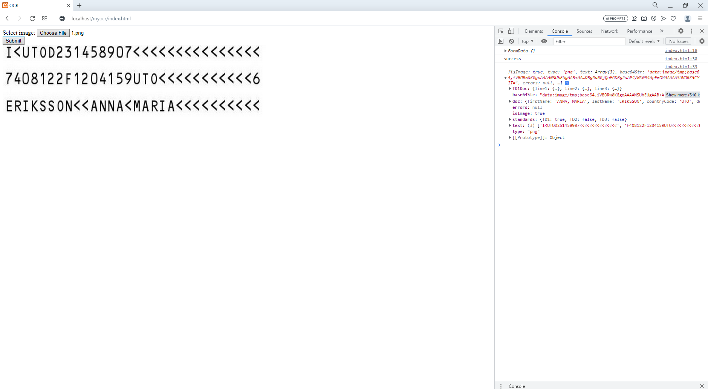

# An ocr reader of scanned TD1, TD2 and TD3 type of type of documents.

## It's implementation of [Thiaggo php wrapper](https://github.com/thiagoalessio/tesseract-ocr-for-php).

### In index.html is rudimentary form with ajax request with `multipart/form-data` for work with files.

### It also draws uploaded image right in index.html.

### It returns, if success(beside drawing of an image) a json with verbose data:

 - An sub json which may be TD1Doc if scanned document is TD1 type, TD2Doc or TD3Doc, also depend on type. It contains raw scanned data in a form of sub json strings, formatted per scanned row, in it's respective format.

 - Second sub json is base64 respresentation of an image, needed for drawing.

 - Third one is extracted data, sorted by it's respective standard.

 - Forth is sub json for errors.

 - Fifth one is marked standard, designated with `bool` value.

 - Sixth one is sub json is array of strings of every scanned row.

 - Seventh and last one is type / extension of uploaded image.

 - There is `testImages` sub folder which is supplied with test images based on different TD standards.

 An example of how returned json looks, logged into console:

 

Additional links:

 - [Tesseract1](https://github.com/tesseract-ocr/tesseract)
 - [TessDocs](https://tesseract-ocr.github.io/tessdoc/Home.html)
 - [TessWiki](https://github.com/UB-Mannheim/tesseract/wiki)
 - [TesseractDownload](https://digi.bib.uni-mannheim.de/tesseract/) which you must install on server machine for `Thiaggo php wrapper` to utilize it.

#### Notice:

 - Add C:\Program Files\Tesseract-OCR to env variable.

/*
Links:
    1. https://github.com/thiagoalessio/tesseract-ocr-for-php
    2. https://github.com/tesseract-ocr/tesseract
    3. https://tesseract-ocr.github.io/tessdoc/Home.html
    4. https://github.com/UB-Mannheim/tesseract/wiki
    5. https://digi.bib.uni-mannheim.de/tesseract/

Notice:
    1. Add C:\Program Files\Tesseract-OCR to env variable.

Upload: 
    1. https://www.w3schools.com/php/php_file_upload.asp
*/

